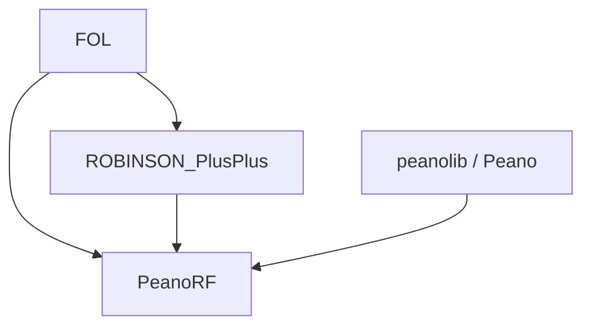
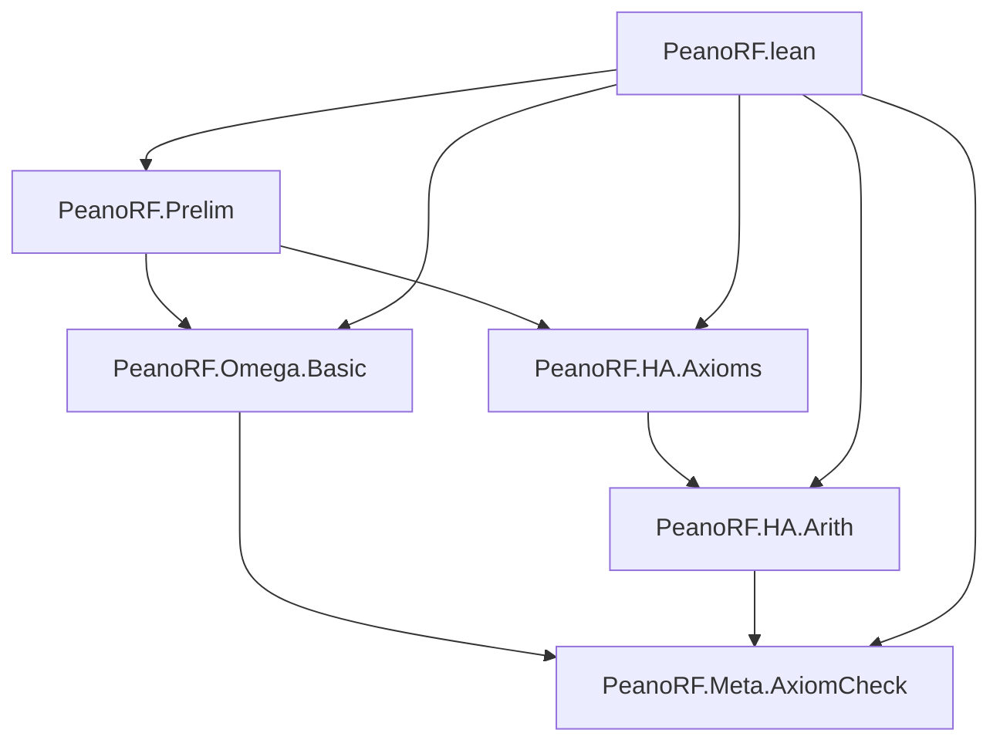

# Diagrama de Dependencias — PeanoRF

**Última actualización:** 2026-09-06 21:00
**Autor**: Julián Calderón Almendros

> **Cuándo este fichero deja de ser útil tal cual**: pasado cierto tamaño (la
> experiencia de proyectos hermanos sitúa el umbral en torno a 40-50 módulos), un
> grafo módulo-a-módulo se queda desactualizado casi de inmediato y mantenerlo exige
> regenerarlo por completo en cada sesión — coste que deja de compensar. Si el proyecto
> cruza ese umbral: sustituye el grafo detallado por una **vista de nivel de
> subsistema**, añade una nota honesta de alcance histórico, y remite a `lake graph`
> para el grafo completo y al día. **No borres el grafo antiguo ni mientas sobre su
> vigencia.**

---

## 1. Dependencias externas (proyectos sibling locales)

Las tres se declaran en `lakefile.lean` como **rutas locales**, no `from git`: se
trabaja contra el árbol de trabajo real de cada proyecto, no contra su último push
(ADR-011).

| Paquete | Ruta | Librería | Qué aporta |
|---|---|---|---|
| `FOL` | `../FOL` | `FOL` | Lógica de primer orden con igualdad: `Term`, `Formula`, `Derives (⊢)`, sustitución con índices de De Bruijn, reglas de igualdad, tácticas. **Solo la mitad demostrativa** — ver §1.1 |
| `ROBINSON_PlusPlus` | `../ROBINSON_PlusPlus` | `ROBINSON_PlusPlus` | Aritmética de Robinson Q extendida sobre FOL⁼ (capa `Minimal`), aritmetización y Gödel (capa `Meta`), teoría derivada (capa `Full`) |
| `peanolib` | `../Peano` | `Peano` | Los naturales `ℕ₀` como tipo inductivo de Lean, con los axiomas de Peano **demostrados**, no postulados |



### 1.1 Qué se importa de FOL, y qué NO (M-5)

```lean
-- SÍ: la mitad demostrativa
import FOL.FOL  FOL.MetaRules  FOL.Tactics  FOL.Deduction
import FOL.Theorems.Derived  FOL.Theorems.Impl  FOL.Theorems.Neg  FOL.Theorems.Quantifiers

-- NO: la mitad modelo-teórica  — PROHIBIDA por MANDATORY M-5
--     FOL.Semantics · FOL.Soundness · FOL.Completeness · FOL.Compacity
```

**Por qué.** Medido el 2026-09-06 (`sondeos/README.md`): los 52 `Classical.choice` de FOL
y los únicos usos de sus tres axiomas clásicos de nivel objeto están **todos** en esa
mitad. Dejándola fuera, la pureza intuicionista de nivel objeto (M-1) deja de depender de
la disciplina de quien escribe y pasa a ser imposible por construcción: violarla exigiría
añadir un `import` a mano. No se importa el barrel `FOL` por eso.

⚠️ **Reglas de operación de estas dependencias:**

1. **FOL se compila siempre desde el proyecto que lo requiere** (este, o
   ROBINSON_PlusPlus) — nunca con `cd ../FOL && lake build`.
2. **Las cuatro deben ir en el mismo toolchain** (hoy `v4.31.0`). Un bump se hace en
   todas a la vez o no se hace.
3. ROBINSON_PlusPlus tiene ramas de trabajo con el árbol en rojo de forma **conocida y
   localizada**. Por eso este proyecto importa capas concretas y **no el barrel
   completo** (ADR-012): un frente abierto aguas arriba no debe romper este build.
4. **Carga ω, medida** (`sondeos/omega_probe.lean`): **99 de 521 declaraciones de ROB++
   (19 %) arrastran alguna ω-regla o meta-axioma** — `gen` 70, `ex_elim` 64, `or_elim` 64,
   `imp_intro` 42, `raa` 13 — y **0 usan lógica clásica**. Es decir: ROB++ es intuicionista
   a nivel objeto pero **no finitario**. Por eso el núcleo de PeanoRF no consume `Full/`
   directamente y existe la capa `PeanoRF.Omega.*` (ADR-016).
5. **Footprint constructivo, medido** (no deducido de los `import` — solo `#print axioms`
   mide):

   | Librería | Decls | Limpias | Nota |
   |---|---:|---:|---|
   | `Peano` (`PeanoNat.Axioms`) | 192 | **192** | 0 `axiom`; ya cumple la diana |
   | `FOL` (barrel completo) | 397 | 332 | los 65 sucios, en la mitad que NO importamos |
   | `RPP.Minimal.Axioms` | 313 | 269 | ⚠️ `axioms` misma arrastra `Classical.choice` |

   La última fila es la deuda META heredada: **cualquier** teorema sobre Q⁺⁺ la hereda
   hoy. Es de nivel meta y su autor va a saldarla; a nivel **objeto** RPP sí es
   constructivo. El gate la contabiliza en cada build (ADR-013).

---

## 2. Estructura del proyecto

```text
PeanoRF/
├── Prelim.lean            # Punto único de contacto con FOL / RPP / Peano
├── Meta/
│   └── AxiomCheck.lean    # Gate de 3 ejes (M-1, M-2, M-7)
├── Omega/
│   └── Basic.lean         # Capa ω: aislada y contada (ADR-016)
├── HA/
│   ├── Axioms.lean        # Conjunto de axiomas de HA + gen_closed (M-8)
│   └── Arith.lean         # Teoremas finitarios (zero_add)
└── _template.lean         # Plantilla de módulo (no se importa)
PeanoRF.lean                  # Módulo raíz (generado por gen-root.bash)
sondeos/                      # Mediciones fuera del build — ver sondeos/README.md
```

## 3. Grafo de dependencias (módulo a módulo)



⚠️ `HA/Axioms.lean` importa además `ROBINSON_PlusPlus.Full.Induction` — **sólo por
`inductionFormula`**, que reutiliza (M-4: no se redefine lo que existe aguas arriba). Ese
módulo declara también `ax_induction`, y el gate verifica que **no se usa**: el import no
es el problema, el uso lo sería.

El gate importa `Prelim` (y deberá importar **cada módulo nuevo**: solo puede auditar lo
que ve), y el barrel raíz lo importa a él el último. Así el barrido corre en cada build.

*(Actualizar a medida que se añaden módulos. Para más de ~15 nodos, agrupar por
subdirectorio con `subgraph`.)*

## 4. Jerarquía de namespaces

| Namespace | Módulo | Notas |
|---|---|---|
| `PeanoRF.Prelim` | `PeanoRF/Prelim.lean` | Namespace plano de un nivel bajo la raíz (ADR-005) |
| `PeanoRF.Meta` | `PeanoRF/Meta/AxiomCheck.lean` | Metaprogramación (gate). El directorio `Meta/` organiza; el namespace sigue siendo de un nivel |
| `PeanoRF.Omega` | `PeanoRF/Omega/Basic.lean` | **Frontera semántica, no sólo organizativa**: bajo este prefijo el gate permite las ω-reglas (ADR-016) |

## 5. Dependencias por nivel

### Nivel 0: Fundamentos

- `Prelim.lean` — solo dependencias externas

### Nivel 1: Teoría y capa ω

- `HA/Axioms.lean` — el conjunto de axiomas de HA y la generalización finitaria
- `Omega/Basic.lean` — ω-reglas sancionadas, **fuera** del núcleo finitario

### Nivel 2: Teoremas

- `HA/Arith.lean` — aritmética probada finitariamente

### Nivel 3: Gate

- `Meta/AxiomCheck.lean` — importa todos los módulos propios para poder auditarlos

### Nivel N: Raíz

- `PeanoRF.lean` — importa todos los módulos

## 6. Exportaciones por módulo

| Módulo | # definiciones públicas | # teoremas exportados |
|---|---:|---:|
| `Prelim` | 0 | 0 |
| `Meta.AxiomCheck` | 0 (4 comandos `elab`) | 0 |
| `Omega.Basic` | 5 alias de ω-reglas | 0 |
| `HA.Axioms` | 1 (`ctx`) | 7 |
| `HA.Arith` | 1 (`phiZeroAdd`) | 1 |

## 7. Notas de diseño

1. **Separación de responsabilidades**: cada módulo trata un aspecto.
2. **Dependencias mínimas**: importar solo lo estrictamente necesario; `open` selectivo.
   Aquí no es una preferencia estética: importar de más aguas arriba **importa también
   sus frentes abiertos**.
3. **Exportaciones selectivas**: solo lo público se exporta (`AI-GUIDE.md` §17).
4. **Sin Mathlib** (ADR-001).
5. **Un namespace plano por módulo** (ADR-005).

## 8. Comandos de verificación

```bash
lake build                        # build completo (25 jobs a fecha de hoy) + gate de 3 ejes
lake graph                        # grafo real y completo (Lake nativo)
bash check-sorry.bash             # sorrys restantes
bash check-doc-sync.bash          # doc ↔ código (AI-GUIDE §27)
lake env lean sondeos/axiom_probe.lean    # footprint de axiomas de las dependencias
lake env lean sondeos/omega_probe.lean    # carga ω de ROB++
lake env lean sondeos/peano_probe.lean    # footprint constructivo de todo Peano
lake env lean sondeos/h2_probe.lean       # footprint de zero_add finitario vs ω
make status                       # bloqueo + sorry
```
