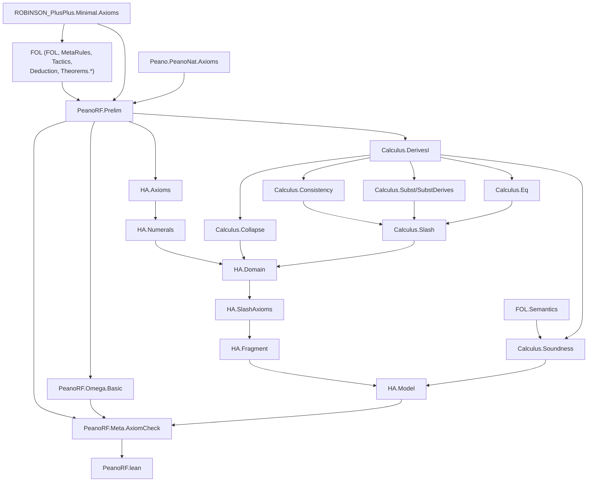

# Technical Reference — PeanoRF

**Last updated:** 2026-09-22
**Author**: Julián Calderón Almendros
**Lean version**: v4.31.0

---

## 0. Naming Conventions Guide for the Reader

This project adopts [Mathlib](https://leanprover-community.github.io/contribute/naming.html)-style naming conventions.
Below are the keys for reading and searching theorems.

### 0.1 Capitalization Rules

- **Theorems/lemmas** (Prop): `snake_case` — `union_comm`, `mem_powerset_iff`
- **Prop definitions** (predicates): `UpperCamelCase` — `IsNat`, `IsFunction`; in theorem names → `lowerCamelCase`: `isNat_zero`
- **Functions** (returning values): `lowerCamelCase` — `powerset`, `union`, `sUnion`
- **Acronyms**: as group — `ZFC` (namespace), `zfc` (in snake_case)

### 0.2 Symbol-to-Word Dictionary

| Symbol | Name | | Symbol | Name | | Symbol | Name |
|--------|------|---|--------|------|---|--------|------|
| ∈ | `mem` | | ∪ | `union` | | + | `add` |
| ∉ | `not_mem` | | ∩ | `inter` | | * | `mul` |
| ⊆ | `subset` | | ⋃ | `sUnion` | | - | `sub`/`neg` |
| ⊂ | `ssubset` | | ⋂ | `sInter` | | / | `div` |
| 𝒫 | `powerset` | | \ | `sdiff` | | ^ | `pow` |
| σ | `succ` | | △ | `symmDiff` | | ∣ | `dvd` |
| ∅ | `empty` | | ᶜ | `compl` | | ≤ | `le` |
| = | `eq` | | ⟂ | `disjoint` | | < | `lt` |
| ≠ | `ne` | | ↔ | `iff` | | 0 | `zero` |
| ¬ | `not` | | → | `of` | | 1 | `one` |

### 0.3 Theorem Name Structure

- **Conclusion first**: `isNat_succ_of_isNat` — conclusion (`isNat_succ`) before hypotheses (`of_isNat`) with `_of_`
- **Biconditionals**: suffix `_iff` — `mem_powerset_iff` (∈ 𝒫 ↔ ⊆)
- **Directions of an iff**: `.mp` (→) and `.mpr` (←) — `mem_powerset_iff.mp`
- **Specifications**: `mem_X_iff` — `mem_succ_iff`, `mem_inter_iff`, `mem_union_iff`

### 0.4 Axiomatic Suffixes

| Suffix | Meaning | | Suffix | Meaning |
|--------|---------|---|--------|---------|
| `_comm` | commutativity | | `_self` | op with itself |
| `_assoc` | associativity | | `_left`/`_right` | lateral variant |
| `_refl` | reflexivity | | `_cancel` | cancellation |
| `_trans` | transitivity | | `_mono` | monotonicity |
| `_antisymm` | antisymmetry | | `_inj` | injectivity (iff) |
| `_symm` | symmetry | | `_injective` | injectivity (pred) |

### 0.5 Naming Migration Status

*(Update this section as the project evolves. Example:)*

✅ **Phase N completed** (date): Names migrated to Mathlib conventions. Examples: ...

---

## 📋 Compliance with AI-GUIDE.md

This document complies with all requirements specified in [AI-GUIDE.md](AI-GUIDE.md):

✅ **(0.5)** **Sistema, no fichero único** — desde el 2026-09-22. Este documento es el
**índice raíz**: catálogo de módulos, grafo de dependencias, teoremas de cabecera y mapa de
navegación. El detalle de cada módulo vive en **tres nodos temáticos** bajo
[`doc/`](doc/), con navegación fuerte en los dos sentidos (§3).
✅ **(1)** All `.lean` modules documented in section 1.1, **con enlace a su nodo temático**
✅ **(2)** Dependencies between modules (table with dependencies column, y el grafo de §2)
✅ **(3)** Namespaces and relationships (table with namespace column)
✅ **(4)** Definitions with location, namespace, and declaration order — en los nodos
✅ **(5)** Axioms and definitions with:

- Human-readable mathematical notation
- Lean 4 signature for code usage
- Explicit dependencies
✅ **(6)** Main theorems without proof with:
- Human-readable mathematical notation
- Lean 4 signature for code usage
- Explicit dependencies
✅ **(7)** Only proven/constructed content (no pending items)
✅ **(8)** Continuous update when loading `.lean` files
✅ **(9)** Self-sufficient as sole reference — **índice + tres nodos**, no hace falta cargar
el proyecto

> 🗑️ **Retirada la deuda de §0.5** que estaba declarada aquí desde el 2026-09-21
> («`REFERENCE.md` pasa de las mil líneas, que es justo lo que AI-GUIDE §0.5 prohíbe»).
> Arbolizado el 2026-09-22 con el corte que ese mismo párrafo proponía.

---

## 1. Module Overview

### 1.1 Module Table

Una fila por fichero `.lean`. **La columna «§» enlaza al nodo temático** donde está
proyectado el detalle: enunciados, footprints y advertencias de alcance. El número de
sección lo confirma la tabla §1 del propio nodo.

⚠️ Los enlaces van **al fichero, sin ancla**: un ancla de Markdown depende de cómo el
renderizador normalice backticks, puntos y símbolos como `⊢ᵢ` o `ℕ`, y un ancla rota es una
cita a algo que no existe. Se prefiere un enlace que no pueda pudrirse.

| Module | Namespace | Dependencies | Status | § |
|--------|-----------|--------------|--------|---|
| `Prelim.lean` | `PeanoRF.Prelim` | FOL (mitad demostrativa), `ROBINSON_PlusPlus.Minimal.Axioms`, `Peano.PeanoNat.Axioms` | 🔄 In progress | [Meta §2.1](doc/REFERENCE-Meta.md) |
| `Meta/AxiomCheck.lean` | `PeanoRF.Meta` | `PeanoRF.Prelim`, `PeanoRF.Omega.Basic` | ✅ Completo | [Meta §2.2](doc/REFERENCE-Meta.md) |
| `Omega/Basic.lean` | `PeanoRF.Omega` | `PeanoRF.Prelim` | ✅ Completo | [Meta §2.3](doc/REFERENCE-Meta.md) |
| `Calculus/DerivesI.lean` | `PeanoRF.Calculus` | `PeanoRF.Prelim`, `FOL.Derives0` | ✅ Completo | [Calculus §2.1](doc/REFERENCE-Calculus.md) |
| `Calculus/Eq.lean` | `PeanoRF.Calculus` | `PeanoRF.Calculus.DerivesI` | ✅ Completo | [Calculus §2.2](doc/REFERENCE-Calculus.md) |
| `Calculus/Soundness.lean` | `PeanoRF.Calculus` | `Calculus.DerivesI`, `FOL.Semantics` | ✅ Completo | [Calculus §2.3](doc/REFERENCE-Calculus.md) |
| `Calculus/Consistency.lean` | `PeanoRF.Calculus` | `Calculus.DerivesI`, `FOL.Finitary0` | ✅ Completo | [Calculus §2.4](doc/REFERENCE-Calculus.md) |
| `Calculus/Slash.lean` | `PeanoRF.Calculus` | `Calculus.{Consistency,SubstDerives,Eq}` | ✅ Completo | [Calculus §2.5](doc/REFERENCE-Calculus.md) |
| `Calculus/Subst.lean` | `PeanoRF.Calculus` | `PeanoRF.Prelim` | ✅ Completo | [Calculus §2.6](doc/REFERENCE-Calculus.md) |
| `Calculus/SubstDerives.lean` | `PeanoRF.Calculus` | `Calculus.{Subst,DerivesI}`, `FOL.Eigenvariable` | ✅ Completo | [Calculus §2.7](doc/REFERENCE-Calculus.md) |
| `Calculus/Collapse.lean` | `PeanoRF.Calculus` | `Calculus.DerivesI` | ✅ Completo | [Calculus §2.8](doc/REFERENCE-Calculus.md) |
| `HA/Domain.lean` | `PeanoRF.HA` | `Calculus.{Collapse,Subst}`, `HA.Numerals` | ✅ Completo | [HA §2.1](doc/REFERENCE-HA.md) |
| `HA/SlashAxioms.lean` | `PeanoRF.HA` | `HA.Domain` | ✅ 6 de 6 | [HA §2.2](doc/REFERENCE-HA.md) |
| `HA/Fragment.lean` | `PeanoRF.HA` | `HA.SlashAxioms` | ✅ la medición, en código | [HA §2.3](doc/REFERENCE-HA.md) |
| `HA/Model.lean` | `PeanoRF.HA` | `HA.Fragment`, `Calculus.Soundness` | 🏁 `hcon` descargada, `−` medido | [HA §2.4](doc/REFERENCE-HA.md) |
| `HA/Axioms.lean` | `PeanoRF.HA` | `PeanoRF.Prelim`, `ROBINSON_PlusPlus.Full.Induction` | ✅ Completo | [HA §2.5](doc/REFERENCE-HA.md) |
| `HA/Numerals.lean` | `PeanoRF.HA` | `PeanoRF.HA.Axioms` | ✅ Completo | [HA §2.6](doc/REFERENCE-HA.md) |
| `HA/Arith.lean` | `PeanoRF.HA` | `PeanoRF.HA.Axioms` | 🔄 In progress | [HA §2.7](doc/REFERENCE-HA.md) |

*Status codes*: ✅ Complete · 🧊 Frozen · 🔶 Partial · 🔄 In progress · ❌ Pending

> ⛔ **Aquí ponía «teoría propia aún por empezar… el primer contenido matemático llega con
> H2». Caducó.** Al 2026-09-22 están cerrados **H2** (los axiomas de HA sobre `⊢ᵢ`), **H3**
> (solidez constructiva), **H3′** (consistencia sin semántica), **H3bis** (`⊢ᵢ ≠ ⊢₀`) y las
> tres etapas de **H3ter**, con la DP del fragmento aritmético **incondicional**.

---

## 2. Dependency Graph

⛔ **Caducado el 2026-09-16 y no corregido hasta el 2026-09-21**: aquí ponía que
`FOL.Semantics` estaba **fuera del grafo a propósito**. ADR-019 enmendó M-5 —`satisfies` no
tiene footprint; lo clásico está en la PRUEBA, no en la semántica— y `Calculus/Soundness.lean`
la importa desde entonces. `HA/Model.lean` construye modelos con ella.

⚠️ **Fuera del grafo, y esto sí sigue** (M-5 vigente): `FOL.Completeness` y `FOL.Compacity`,
**prohibidas**. Ahí viven los `Classical.choice` de FOL y los únicos usos de sus tres
axiomas clásicos de nivel objeto. `FOL.Soundness0` está **permitida pero no se importa**:
`derivesI_soundness` se demuestra aquí y mide `[propext, Quot.sound]`, mientras que
`derives0_soundness` arrastra `Classical.choice` — que es exactamente el precio de las tres
reglas clásicas de `⊢₀` (ADR-019).

---

## 3. Mapa de navegación — los tres nodos temáticos

El detalle de cada módulo **no vive aquí** (AI-GUIDE §0.5). Está en tres nodos, y cada uno
enlaza de vuelta a este índice y de forma cruzada a los otros dos:

| nodo | qué cubre | módulos |
|---|---|---|
| ⚙️ **[doc/REFERENCE-Meta.md](doc/REFERENCE-Meta.md)** | contacto con las dependencias, **gate de pureza** de tres ejes, capa ω | `Prelim`, `Meta/AxiomCheck`, `Omega/Basic` |
| 🔧 **[doc/REFERENCE-Calculus.md](doc/REFERENCE-Calculus.md)** | el cálculo **`⊢ᵢ`**, solidez, consistencia sintáctica, sustitución, colapso y **la barra de Kleene** | los 8 de `Calculus/` |
| 🎯 **[doc/REFERENCE-HA.md](doc/REFERENCE-HA.md)** | axiomas de HA, numerales, **dominio**, los 34 barrados, el **fragmento** y el **modelo** sobre `ℕ` | los 7 de `HA/` |

**Por dónde entrar según lo que se busque:**

| quiero… | voy a |
|---|---|
| saber **qué demuestra el proyecto** | §4 de aquí — los teoremas de cabecera, con lo que **no** dicen |
| escribir una prueba nueva sobre `⊢ᵢ` | [Calculus](doc/REFERENCE-Calculus.md) §2.1–2.2 y §5 (exports) |
| entender **por qué HA no tiene la DP sin más** | [HA](doc/REFERENCE-HA.md) §1 y §2.1 (el dominio) |
| saber **qué se puede importar** de FOL/RPP | §2 de aquí (M-5) y [Meta](doc/REFERENCE-Meta.md) §2.1 |
| saber **qué mide el gate** y con qué polaridad | [Meta](doc/REFERENCE-Meta.md) §2.2 |
| ver **el footprint** de un teorema | la tabla de su módulo, en el nodo que le toque |

---

## 4. Los teoremas de cabecera

Todos en **`[propext, Quot.sound]`** salvo donde se diga.

| Teorema | Enunciado matemático | Módulo |
|---|---|---|
| 🏁 `derivesI_soundness` | `Γ ⊢ᵢ f → Γ ⊨ f` — **la solidez intuicionista, demostrada intuicionistamente** | `Calculus/Soundness.lean` |
| `consistI_syn` | la consistencia de `⊢ᵢ` **sin un solo modelo**, por secuentes sin corte | `Calculus/Consistency.lean` |
| 🏁🏁🏁 `derivesI_ne_derives0` | `∃φ. ([] ⊢₀ φ) ∧ ¬([] ⊢ᵢ φ)` — **el primer teorema que falla clásicamente** | `Calculus/Slash.lean` |
| `disjunction_property` · `existence_property` | la DP y la EP **de la LÓGICA**, sobre contexto vacío | `Calculus/Slash.lean` |
| `disjunction_property_of_slashed` | el teorema general: si todo axioma de `T` está barrado, `T` tiene la DP | `Calculus/Slash.lean` |
| 🏁🏁 `haDisjunctionProperty_core` | la DP de HA **con `coreAxioms` ya descargado** (28 por Harrop + 6 duros) | `HA/SlashAxioms.lean` |
| `haDisjunctionProperty_harrop` | …y `hInd` + `hlift` descargadas para instancias de Harrop | `HA/SlashAxioms.lean` |
| 🏁 `qDisjunctionProperty_arith` / `…_arithT` / `…_arithTM` | la DP del fragmento: 17 / 19 / **22** axiomas, con la consistencia como única hipótesis | `HA/Fragment.lean` |
| 🏁 `hcon_fragment` | **la consistencia del fragmento, DEMOSTRADA** (modelo estándar sobre `ℕ`) | `HA/Model.lean` |
| 🏁🏁🏁 **`qDisjunctionProperty_arithTM_final`** | **la DP del fragmento aritmético, SIN NINGUNA HIPÓTESIS** | `HA/Model.lean` |
| ⛔ `sub_neither` | `5̄ − 7̄` es **indeterminado**: ni la igualdad ni su negación son derivables, para ningún numeral | `HA/Model.lean` |
| ⛔⛔ `hNum_false_on_sub` | **`hNum` sobre la signatura completa es FALSA**, con testigo | `HA/Model.lean` |

⛔ **Lo que estos teoremas NO dicen.** El enunciado ingenuo de H3ter —«HA tiene la propiedad
de disyunción»— es **falso** sobre la sintaxis genérica de FOL, y está medido
(`sondeos/junk_probe.lean`): `ctx [] ⊢ᵢ (foo < bar ∨ foo = bar ∨ bar < foo)` es derivable con
`foo`, `bar` **ajenos al lenguaje**, y ninguna rama lo es. Por eso el dominio (`Grounded L`)
y el colapso (`collapseF L`) están **en el enunciado** y no en la letra pequeña.

---

## 5. Notaciones y exports

| dónde | qué |
|---|---|
| [Calculus §4](doc/REFERENCE-Calculus.md) | la única notación propia: `Γ ⊢ᵢ f` (`infix:50`) |
| [Calculus §5](doc/REFERENCE-Calculus.md) | lo que exporta `PeanoRF.Calculus` |
| [HA §4](doc/REFERENCE-HA.md) | lo que exporta `PeanoRF.HA` |
| [Meta §2.1](doc/REFERENCE-Meta.md) | `PeanoRF.Prelim` no declara nada propio |

---

## 6. Documentation Status

### 6.1 Fully Projected Files

Los **18** módulos del árbol, con su nodo y la fecha de su última proyección:

| módulo | nodo | § | proyectado |
|---|---|---|---|
| `Prelim.lean` | Meta | 2.1 | 2026-09-06 (0 declaraciones propias) |
| `Meta/AxiomCheck.lean` | Meta | 2.2 | 2026-09-18 |
| `Omega/Basic.lean` | Meta | 2.3 | 2026-09-06 |
| `Calculus/DerivesI.lean` | Calculus | 2.1 | 2026-09-16 |
| `Calculus/Eq.lean` | Calculus | 2.2 | 2026-09-18 |
| `Calculus/Soundness.lean` | Calculus | 2.3 | 2026-09-16 |
| `Calculus/Consistency.lean` | Calculus | 2.4 | 2026-09-17 |
| `Calculus/Slash.lean` | Calculus | 2.5 | 2026-09-18 |
| `Calculus/Subst.lean` | Calculus | 2.6 | 2026-09-17 |
| `Calculus/SubstDerives.lean` | Calculus | 2.7 | 2026-09-17 |
| `Calculus/Collapse.lean` | Calculus | 2.8 | 2026-09-18 |
| `HA/Domain.lean` | HA | 2.1 | 2026-09-18 |
| `HA/SlashAxioms.lean` | HA | 2.2 | 2026-09-18 |
| `HA/Fragment.lean` | HA | 2.3 | 2026-09-21 |
| `HA/Model.lean` | HA | 2.4 | 2026-09-21 |
| `HA/Axioms.lean` | HA | 2.5 | 2026-09-16 |
| `HA/Numerals.lean` | HA | 2.6 | 2026-09-18 |
| `HA/Arith.lean` | HA | 2.7 | 2026-09-16 |

⛔ **`[C]` mira la FILA, no la SECCIÓN, y eso sigue igual después de arbolizar.** El control
comprueba que el nombre del módulo **aparezca** en `REFERENCE.md` o en `doc/REFERENCE-*.md`;
no comprueba que tenga sección propia. `Fragment` y `Model` estuvieron tres días con ✓ y sin
proyectar. Endurecerlo es decisión aparte (`NEXT-STEPS.md`, deudas vivas).

### 6.2 Partially Projected Files

*(Ninguno.)*

### 6.3 Notes

Este documento es el **índice raíz** del sistema REFERENCE (AI-GUIDE §0.5, ADR-007), y desde
el 2026-09-22 lo es de verdad: el detalle vive en `doc/REFERENCE-{Meta,Calculus,HA}.md`.

⚠️ **Cuándo cortar otro nodo.** El criterio no es el número de líneas sino el de módulos que
un lector tiene que atravesar para encontrar lo suyo. Si `HA/` pasa de la docena de módulos,
el corte siguiente es por capas —los axiomas y numerales por un lado, la barra y el
fragmento por otro— y va **antes** de añadir la fila número trece, no después.
