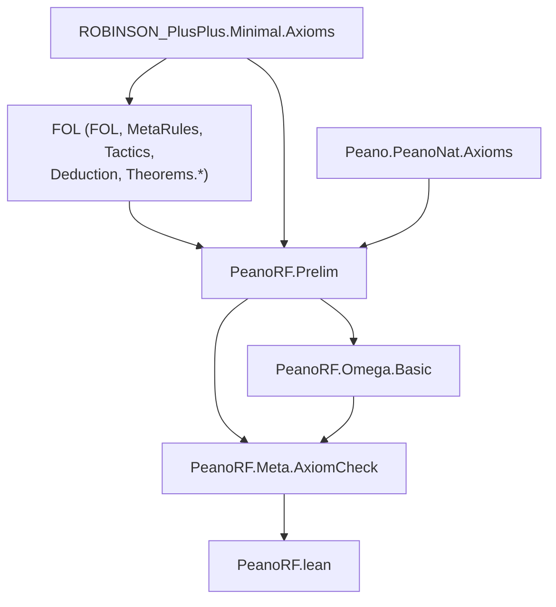

# Technical Reference — PeanoRF

**Last updated:** 2026-09-06 21:00
**Author**: Julián Calderón Almendros
**Lean version**: v4.31.0

---

## 0. Naming Conventions Guide for the Reader

This project adopts [Mathlib](https://leanprover-community.github.io/contribute/naming.html)-style naming conventions.
Below are the keys for reading and searching theorems.

### 0.1 Capitalization Rules

- **Theorems/lemmas** (Prop): `snake_case` — `union_comm`, `mem_powerset_iff`
- **Prop definitions** (predicates): `UpperCamelCase` — `IsNat`, `IsFunction`; in theorem names → `lowerCamelCase`: `isNat_zero`
- **Functions** (returning values): `lowerCamelCase` — `powerset`, `union`, `sUnion`
- **Acronyms**: as group — `ZFC` (namespace), `zfc` (in snake_case)

### 0.2 Symbol-to-Word Dictionary

| Symbol | Name | | Symbol | Name | | Symbol | Name |
|--------|------|---|--------|------|---|--------|------|
| ∈ | `mem` | | ∪ | `union` | | + | `add` |
| ∉ | `not_mem` | | ∩ | `inter` | | * | `mul` |
| ⊆ | `subset` | | ⋃ | `sUnion` | | - | `sub`/`neg` |
| ⊂ | `ssubset` | | ⋂ | `sInter` | | / | `div` |
| 𝒫 | `powerset` | | \ | `sdiff` | | ^ | `pow` |
| σ | `succ` | | △ | `symmDiff` | | ∣ | `dvd` |
| ∅ | `empty` | | ᶜ | `compl` | | ≤ | `le` |
| = | `eq` | | ⟂ | `disjoint` | | < | `lt` |
| ≠ | `ne` | | ↔ | `iff` | | 0 | `zero` |
| ¬ | `not` | | → | `of` | | 1 | `one` |

### 0.3 Theorem Name Structure

- **Conclusion first**: `isNat_succ_of_isNat` — conclusion (`isNat_succ`) before hypotheses (`of_isNat`) with `_of_`
- **Biconditionals**: suffix `_iff` — `mem_powerset_iff` (∈ 𝒫 ↔ ⊆)
- **Directions of an iff**: `.mp` (→) and `.mpr` (←) — `mem_powerset_iff.mp`
- **Specifications**: `mem_X_iff` — `mem_succ_iff`, `mem_inter_iff`, `mem_union_iff`

### 0.4 Axiomatic Suffixes

| Suffix | Meaning | | Suffix | Meaning |
|--------|---------|---|--------|---------|
| `_comm` | commutativity | | `_self` | op with itself |
| `_assoc` | associativity | | `_left`/`_right` | lateral variant |
| `_refl` | reflexivity | | `_cancel` | cancellation |
| `_trans` | transitivity | | `_mono` | monotonicity |
| `_antisymm` | antisymmetry | | `_inj` | injectivity (iff) |
| `_symm` | symmetry | | `_injective` | injectivity (pred) |

### 0.5 Naming Migration Status

*(Update this section as the project evolves. Example:)*

✅ **Phase N completed** (date): Names migrated to Mathlib conventions. Examples: ...

---

## 📋 Compliance with AI-GUIDE.md

This document complies with all requirements specified in [AI-GUIDE.md](AI-GUIDE.md):

✅ **(1)** All `.lean` modules documented in section 1.1
✅ **(2)** Dependencies between modules (table with dependencies column)
✅ **(3)** Namespaces and relationships (table with namespace column)
✅ **(4)** Definitions with location, namespace, and declaration order
✅ **(5)** Axioms and definitions with:

- Human-readable mathematical notation
- Lean 4 signature for code usage
- Explicit dependencies
✅ **(6)** Main theorems without proof with:
- Human-readable mathematical notation
- Lean 4 signature for code usage
- Explicit dependencies
✅ **(7)** Only proven/constructed content (no pending items)
✅ **(8)** Continuous update when loading `.lean` files
✅ **(9)** Self-sufficient as sole reference (no need to load entire project)

---

## 1. Module Overview

### 1.1 Module Table

| Module | Namespace | Dependencies | Status |
|--------|-----------|--------------|--------|
| `Prelim.lean` | `PeanoRF.Prelim` | FOL (mitad demostrativa), `ROBINSON_PlusPlus.Minimal.Axioms`, `Peano.PeanoNat.Axioms` | 🔄 In progress |
| `Meta/AxiomCheck.lean` | `PeanoRF.Meta` | `PeanoRF.Prelim`, `PeanoRF.Omega.Basic` | ✅ Completo |
| `Omega/Basic.lean` | `PeanoRF.Omega` | `PeanoRF.Prelim` | ✅ Completo |
| `HA/Axioms.lean` | `PeanoRF.HA` | `PeanoRF.Prelim`, `ROBINSON_PlusPlus.Full.Induction` | ✅ Completo |
| `HA/Arith.lean` | `PeanoRF.HA` | `PeanoRF.HA.Axioms` | 🔄 In progress |

*Status codes*: ✅ Complete · 🧊 Frozen · 🔶 Partial · 🔄 In progress · ❌ Pending

> **Teoría propia aún por empezar.** El alcance está fijado (`PLANNING.md` §1) y el
> andamiaje verificado; este catálogo documenta hoy el módulo de contacto, el gate y la
> capa ω. El primer contenido matemático llega con **H2** (`NEXT-STEPS.md`).

---

## 2. Dependency Graph



⚠️ **Fuera del grafo a propósito** (M-5): `FOL.Semantics`, `FOL.Soundness`,
`FOL.Completeness` y `FOL.Compacity`. Ahí viven los 52 `Classical.choice` de FOL y los
únicos usos de sus tres axiomas clásicos de nivel objeto.

---

## 3. Module Descriptions

### 3.1 Prelim.lean

**Namespace**: `PeanoRF.Prelim`
**Dependencies**: `FOL`, `ROBINSON_PlusPlus.Minimal.Axioms`, `Peano.PeanoNat.Axioms`
**Last updated**: 2026-09-06 14:00
**Status**: 🔄 In progress (sin declaraciones propias)
**@axiom_system**: FOL⁼ (vía `FOL`) + Q⁺⁺ (vía `ROBINSON_PlusPlus`)
**@importance**: high

Punto **único** de contacto con las librerías aguas arriba. Hoy no declara nada propio:
fija el *import surface* del proyecto y documenta por qué es el que es.

Dos decisiones que este módulo materializa, ambas con ADR:

* **No se redefine `ExistsUnique` ni la notación `∃!`/`∃¹`** — vienen de `Peano.Prelim`.
  Dos copias en dos namespaces son **dos constantes que no componen**, y el coste no se
  paga al escribirlas sino después, en puentes `rfl` por cada teorema que las cruce
  (ADR-010).
* **No se importan los barrels completos** de ROBINSON_PlusPlus ni de Peano, sino las
  capas concretas que se usan (ADR-012).

### 3.2 Meta/AxiomCheck.lean

**Namespace**: `PeanoRF.Meta`
**Dependencies**: `PeanoRF.Prelim`
**Last updated**: 2026-09-06 14:00
**Status**: ✅ Completo (gate en producción)
**@axiom_system**: n/a (metaprogramación)
**@importance**: high

Gate de compilación de las MANDATORIES M-1 y M-2 (ADR-013). Corre en **cada `lake build`**
y recorre toda declaración propia con `Lean.collectAxioms`. Vigila dos ejes:

| Eje | Qué exige | Severidad |
|---|---|---|
| **OBJETO** | Ninguna dependencia de `FOL.MetaRules.dne`, `FOL.Theorems.Neg.dne`, `FOL.Theorems.Quantifiers.forall_not_impl_exists_not` | error, sin baseline |
| **FINITARIO** | Ninguna dependencia de las 5 ω-reglas de FOL ni de los 4 meta-axiomas de ROB++ | error fuera de `PeanoRF.Omega.*`; recuento dentro |
| **META** | Footprint `⊆ {propext, Quot.sound}` (+`sorryAx`) | error; deuda heredada de RPP con aviso y recuento |

La deuda heredada se clasifica **por procedencia, no por nombre de axioma**: un
`Classical.choice` solo cuenta como heredado si entra atravesando una constante de
`FOL`/`ROBINSON_PlusPlus`/`Peano` (ver ADR-015 y el smoke test que lo destapó).

**Comandos que define**:

```lean
#assert_no_classical   <ident>   -- falla si el símbolo depende de Classical.choice
#assert_intuitionistic <ident>   -- falla si usa un axioma clásico de nivel objeto
#assert_finitary       <ident>   -- falla si usa una ω-regla o meta-axioma
#assert_constructive_footprint   -- el barrido exhaustivo (se invoca al final del módulo)
```

**Puntos de configuración** (todos `private`, documentados en el fichero):
`objectClassicalAxioms`, `allowedAxioms`, `inheritedMetaDebt`, `omegaAxioms`,
`omegaLayer`, `dependencyRoots`, `metaDebtIsError`, `baselineOwn`.

---

### 3.3 Omega/Basic.lean

**Namespace**: `PeanoRF.Omega`
**Dependencies**: `PeanoRF.Prelim`
**Last updated**: 2026-09-06 18:00
**Status**: ✅ Completo
**@axiom_system**: ω-lógica sobre Q⁺⁺ (**fuera** del núcleo HA)
**@importance**: high

**La capa ω declarada** (ADR-016). Todo lo que viva bajo `PeanoRF.Omega.*` está fuera del
núcleo finitario: el gate permite aquí las ω-reglas y las **cuenta** en cada build.

Expone cinco alias sancionados, para que toda dependencia de la capa ω sea visible en el
nombre: `gen`, `imp_intro`, `raa`, `or_elim`, `ex_elim`.

**Qué se pierde al cruzar la frontera**: en ω-lógica `⊢` no es r.e. Un teorema de esta capa
sirve para el espejo hacia Peano (ω-lógica es sólida para ℕ), pero **no** como contenido
fundacional ni como pieza del meta-lenguaje.

⚠️ **La regla que nunca debe cruzarse**: no demostrar soundness de `Derives` para
derivaciones con `raa`/`imp_intro` (M-9) — sus premisas META se cumplen vacíamente.

---

### 3.4 HA/Axioms.lean — el conjunto de axiomas de HA

**Namespace**: `PeanoRF.HA`
**Last updated**: 2026-09-06 21:00
**Status**: ✅ Completo
**@axiom_system**: HA finitaria (Q⁺⁺ + esquema de inducción **en el contexto**)
**@importance**: high

Axiomatiza HA **sin postular derivabilidad** (M-8). Compárese con
`ROBINSON_PlusPlus.Full.ax_induction`, que declara `axiom : axioms ⊢ inductionFormula φ`.

**Definición central**:

```lean
def ctx (insts : List Formula) : List Formula :=
  axioms ++ insts.map inductionFormula
```

`insts` es la lista de fórmulas cuyas instancias de inducción entran en el contexto. Es
finita por construcción — eso es lo que hace de HA una teoría r.e. y no ω-lógica — y queda
**en el tipo de cada teorema**: se lee del enunciado qué inducción hizo falta.

**Teoremas** (todos genéricos en `insts`):

| Nombre | Enunciado |
|---|---|
| `mem_ctx_of_mem_axioms` | `f ∈ axioms → f ∈ ctx insts` |
| `ax'` | `f ∈ axioms → ctx insts ⊢ f` |
| `ind` | `φ ∈ insts → ctx insts ⊢ inductionFormula φ` |
| `mono` | `insts ⊆ insts' → ctx insts ⊢ ψ → ctx insts' ⊢ ψ` |
| `axioms_lift` | `axioms.map (liftFormula 0) = axioms` (por `rfl`: los axiomas son sentencias cerradas) |
| `ctx_lift` | el contexto entero es cerrado si lo son las instancias |
| **`gen_closed`** | **`Γ.map (liftFormula 0) = Γ → Γ ⊢ A → Γ ⊢ ∀A`** |
| `induction_object` | inducción object-level, con la instancia tomada del contexto |

🔑 **`gen_closed` es el resultado central**: sobre un contexto cerrado la generalización es
finitaria (`Derives.intro_forall`), luego **la ω-regla `gen` no hace falta**. Lo que `gen`
obtiene de infinitas premisas `Γ ⊢ A[n]`, esto lo obtiene de una prueba uniforme con la
variable libre. Su footprint es `[propext]`.

---

### 3.5 HA/Arith.lean — primer teorema finitario

**Namespace**: `PeanoRF.HA`
**Last updated**: 2026-09-06 21:00
**Status**: 🔄 In progress
**@importance**: high

```lean
def phiZeroAdd : Formula := add zero (.var 0) =eq (.var 0)
theorem zero_add : ctx [phiZeroAdd] ⊢ Formula.forall phiZeroAdd
```

`∀x. 0 + x = x` **sin ω-reglas y sin `ax_induction`**. El tipo declara la única instancia
de inducción usada.

**La medición que justifica ADR-016** (`sondeos/h2_probe.lean`):

| símbolo | footprint |
|---|---|
| `PeanoRF.HA.zero_add` | `propext, Classical.choice, Quot.sound` |
| `ROBINSON_PlusPlus.Full.zero_add` | los tres anteriores **+ `MetaRules.gen` + `MetaRules.imp_intro` + `ax_induction`** |

**Tres axiomas menos, misma matemática.** El `Classical.choice` restante es la deuda META
heredada de la codificación `String` de RPP.

---

## 4. Theorems

### 4.1 HA/Arith.lean

| Teorema | Enunciado matemático | Instancias de inducción |
|---|---|---|
| `zero_add` | `HA ⊢ ∀x. 0 + x = x` | `[phiZeroAdd]` |

---

## 5. Notations

*(Ninguna propia. Las notaciones disponibles vienen de FOL, ROBINSON_PlusPlus y Peano;
se catalogarán aquí las que este proyecto introduzca.)*

---

## 6. Exports

### 6.1 Prelim.lean

```lean
-- (vacío: el módulo no declara nada propio todavía)
```

---

## 7. Documentation Status

### 7.1 Fully Projected Files

- `Prelim.lean` — proyectado (0 declaraciones propias)

### 7.2 Partially Projected Files

*(None)*

### 7.3 Notes

Este documento es el índice raíz del sistema REFERENCE (AI-GUIDE §0.5). Cuando el
proyecto crezca, los nodos temáticos van en `doc/REFERENCE-{tema}.md` (ADR-007) y esta
tabla pasa a ser solo el índice.
