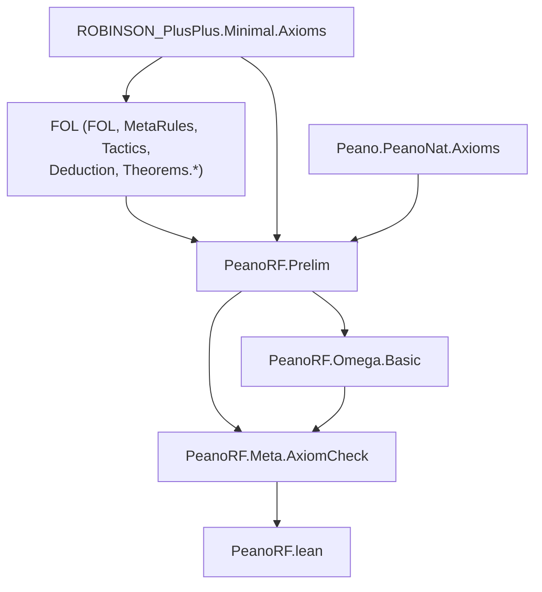

# Technical Reference — PeanoRF

**Last updated:** 2026-09-21
**Author**: Julián Calderón Almendros
**Lean version**: v4.31.0

---

## 0. Naming Conventions Guide for the Reader

This project adopts [Mathlib](https://leanprover-community.github.io/contribute/naming.html)-style naming conventions.
Below are the keys for reading and searching theorems.

### 0.1 Capitalization Rules

- **Theorems/lemmas** (Prop): `snake_case` — `union_comm`, `mem_powerset_iff`
- **Prop definitions** (predicates): `UpperCamelCase` — `IsNat`, `IsFunction`; in theorem names → `lowerCamelCase`: `isNat_zero`
- **Functions** (returning values): `lowerCamelCase` — `powerset`, `union`, `sUnion`
- **Acronyms**: as group — `ZFC` (namespace), `zfc` (in snake_case)

### 0.2 Symbol-to-Word Dictionary

| Symbol | Name | | Symbol | Name | | Symbol | Name |
|--------|------|---|--------|------|---|--------|------|
| ∈ | `mem` | | ∪ | `union` | | + | `add` |
| ∉ | `not_mem` | | ∩ | `inter` | | * | `mul` |
| ⊆ | `subset` | | ⋃ | `sUnion` | | - | `sub`/`neg` |
| ⊂ | `ssubset` | | ⋂ | `sInter` | | / | `div` |
| 𝒫 | `powerset` | | \ | `sdiff` | | ^ | `pow` |
| σ | `succ` | | △ | `symmDiff` | | ∣ | `dvd` |
| ∅ | `empty` | | ᶜ | `compl` | | ≤ | `le` |
| = | `eq` | | ⟂ | `disjoint` | | < | `lt` |
| ≠ | `ne` | | ↔ | `iff` | | 0 | `zero` |
| ¬ | `not` | | → | `of` | | 1 | `one` |

### 0.3 Theorem Name Structure

- **Conclusion first**: `isNat_succ_of_isNat` — conclusion (`isNat_succ`) before hypotheses (`of_isNat`) with `_of_`
- **Biconditionals**: suffix `_iff` — `mem_powerset_iff` (∈ 𝒫 ↔ ⊆)
- **Directions of an iff**: `.mp` (→) and `.mpr` (←) — `mem_powerset_iff.mp`
- **Specifications**: `mem_X_iff` — `mem_succ_iff`, `mem_inter_iff`, `mem_union_iff`

### 0.4 Axiomatic Suffixes

| Suffix | Meaning | | Suffix | Meaning |
|--------|---------|---|--------|---------|
| `_comm` | commutativity | | `_self` | op with itself |
| `_assoc` | associativity | | `_left`/`_right` | lateral variant |
| `_refl` | reflexivity | | `_cancel` | cancellation |
| `_trans` | transitivity | | `_mono` | monotonicity |
| `_antisymm` | antisymmetry | | `_inj` | injectivity (iff) |
| `_symm` | symmetry | | `_injective` | injectivity (pred) |

### 0.5 Naming Migration Status

*(Update this section as the project evolves. Example:)*

✅ **Phase N completed** (date): Names migrated to Mathlib conventions. Examples: ...

---

## 📋 Compliance with AI-GUIDE.md

This document complies with all requirements specified in [AI-GUIDE.md](AI-GUIDE.md):

✅ **(1)** All `.lean` modules documented in section 1.1
✅ **(2)** Dependencies between modules (table with dependencies column)
✅ **(3)** Namespaces and relationships (table with namespace column)
✅ **(4)** Definitions with location, namespace, and declaration order
✅ **(5)** Axioms and definitions with:

- Human-readable mathematical notation
- Lean 4 signature for code usage
- Explicit dependencies
✅ **(6)** Main theorems without proof with:
- Human-readable mathematical notation
- Lean 4 signature for code usage
- Explicit dependencies
✅ **(7)** Only proven/constructed content (no pending items)
✅ **(8)** Continuous update when loading `.lean` files
✅ **(9)** Self-sufficient as sole reference (no need to load entire project)

---

## 1. Module Overview

### 1.1 Module Table

| Module | Namespace | Dependencies | Status |
|--------|-----------|--------------|--------|
| `Prelim.lean` | `PeanoRF.Prelim` | FOL (mitad demostrativa), `ROBINSON_PlusPlus.Minimal.Axioms`, `Peano.PeanoNat.Axioms` | 🔄 In progress |
| `Meta/AxiomCheck.lean` | `PeanoRF.Meta` | `PeanoRF.Prelim`, `PeanoRF.Omega.Basic` | ✅ Completo |
| `Omega/Basic.lean` | `PeanoRF.Omega` | `PeanoRF.Prelim` | ✅ Completo |
| `Calculus/DerivesI.lean` | `PeanoRF.Calculus` | `PeanoRF.Prelim`, `FOL.Derives0` | ✅ Completo |
| `Calculus/Eq.lean` | `PeanoRF.Calculus` | `PeanoRF.Calculus.DerivesI` | ✅ Completo |
| `Calculus/Soundness.lean` | `PeanoRF.Calculus` | `Calculus.DerivesI`, `FOL.Semantics` | ✅ Completo |
| `Calculus/Consistency.lean` | `PeanoRF.Calculus` | `Calculus.DerivesI`, `FOL.Finitary0` | ✅ Completo |
| `Calculus/Subst.lean` | `PeanoRF.Calculus` | `PeanoRF.Prelim` | ✅ Completo |
| `Calculus/SubstDerives.lean` | `PeanoRF.Calculus` | `Calculus.{Subst,DerivesI}`, `FOL.Eigenvariable` | ✅ Completo |
| `Calculus/Collapse.lean` | `PeanoRF.Calculus` | `Calculus.DerivesI` | ✅ Completo |
| `HA/Domain.lean` | `PeanoRF.HA` | `Calculus.{Collapse,Subst}`, `HA.Numerals` | ✅ Completo |
| `HA/SlashAxioms.lean` | `PeanoRF.HA` | `HA.Domain` | ✅ 6 de 6 |
| `Calculus/Slash.lean` | `PeanoRF.Calculus` | `Calculus.{Consistency,SubstDerives,Eq}` | ✅ Completo |
| `HA/Axioms.lean` | `PeanoRF.HA` | `PeanoRF.Prelim`, `ROBINSON_PlusPlus.Full.Induction` | ✅ Completo |
| `HA/Arith.lean` | `PeanoRF.HA` | `PeanoRF.HA.Axioms` | 🔄 In progress |
| `HA/Numerals.lean` | `PeanoRF.HA` | `PeanoRF.HA.Axioms` | ✅ Completo |

*Status codes*: ✅ Complete · 🧊 Frozen · 🔶 Partial · 🔄 In progress · ❌ Pending

> **Teoría propia aún por empezar.** El alcance está fijado (`PLANNING.md` §1) y el
> andamiaje verificado; este catálogo documenta hoy el módulo de contacto, el gate y la
> capa ω. El primer contenido matemático llega con **H2** (`NEXT-STEPS.md`).

---

## 2. Dependency Graph



⚠️ **Fuera del grafo a propósito** (M-5): `FOL.Semantics`, `FOL.Soundness`,
`FOL.Completeness` y `FOL.Compacity`. Ahí viven los 52 `Classical.choice` de FOL y los
únicos usos de sus tres axiomas clásicos de nivel objeto.

---

## 3. Module Descriptions

### 3.1 Prelim.lean

**Namespace**: `PeanoRF.Prelim`
**Dependencies**: `FOL`, `ROBINSON_PlusPlus.Minimal.Axioms`, `Peano.PeanoNat.Axioms`
**Last updated**: 2026-09-06 14:00
**Status**: 🔄 In progress (sin declaraciones propias)
**@axiom_system**: FOL⁼ (vía `FOL`) + Q⁺⁺ (vía `ROBINSON_PlusPlus`)
**@importance**: high

Punto **único** de contacto con las librerías aguas arriba. Hoy no declara nada propio:
fija el *import surface* del proyecto y documenta por qué es el que es.

Dos decisiones que este módulo materializa, ambas con ADR:

* **No se redefine `ExistsUnique` ni la notación `∃!`/`∃¹`** — vienen de `Peano.Prelim`.
  Dos copias en dos namespaces son **dos constantes que no componen**, y el coste no se
  paga al escribirlas sino después, en puentes `rfl` por cada teorema que las cruce
  (ADR-010).
* **No se importan los barrels completos** de ROBINSON_PlusPlus ni de Peano, sino las
  capas concretas que se usan (ADR-012).

### 3.2 Meta/AxiomCheck.lean

**Namespace**: `PeanoRF.Meta`
**Dependencies**: `PeanoRF.Prelim`
**Last updated**: 2026-09-06 14:00
**Status**: ✅ Completo (gate en producción)
**@axiom_system**: n/a (metaprogramación)
**@importance**: high

Gate de compilación de las MANDATORIES M-1 y M-2 (ADR-013). Corre en **cada `lake build`**
y recorre toda declaración propia con `Lean.collectAxioms`. Vigila dos ejes:

| Eje | Qué exige | Severidad |
|---|---|---|
| **OBJETO** | Ninguna dependencia de `FOL.MetaRules.dne`, `FOL.Theorems.Neg.dne`, `FOL.Theorems.Quantifiers.forall_not_impl_exists_not` | error, sin baseline |
| **FINITARIO** | Ninguna dependencia de las 5 ω-reglas de FOL ni de los 4 meta-axiomas de ROB++ | error fuera de `PeanoRF.Omega.*`; recuento dentro |
| **META** | Footprint `⊆ {propext, Quot.sound}` (+`sorryAx`) | error; deuda heredada de RPP con aviso y recuento |

La deuda heredada se clasifica **por procedencia, no por nombre de axioma**: un
`Classical.choice` solo cuenta como heredado si entra atravesando una constante de
`FOL`/`ROBINSON_PlusPlus`/`Peano` (ver ADR-015 y el smoke test que lo destapó).

**Comandos que define**:

```lean
#assert_no_classical   <ident>   -- falla si el símbolo depende de Classical.choice
#assert_intuitionistic <ident>   -- falla si usa un axioma clásico de nivel objeto
#assert_finitary       <ident>   -- falla si usa una ω-regla o meta-axioma
#assert_constructive_footprint   -- el barrido exhaustivo (se invoca al final del módulo)
```

**Puntos de configuración** (todos `private`, documentados en el fichero):
`objectClassicalAxioms`, `allowedAxioms`, `inheritedMetaDebt`, `omegaAxioms`,
`omegaLayer`, `dependencyRoots`, `metaDebtIsError` (**`true` desde 2026-09-18**), `baselineOwn`,
`classicalCtorShortNames`, `benignForeignCtors`, `omegaAllowedForeignCtors`.

**Control de constructores, POR TELESCOPIO** (reescrito 2026-09-17, revisado esa misma
tarde; ADR-018). Descubre las relaciones de derivabilidad del entorno por su **tipo**:
inductivo **recursivo**, que menciona `Formula`, acaba en `Prop` y todos cuyos argumentos
son `Formula`, `List Formula` o `Nat`. Cubre deducción natural, secuentes de uno y dos
lados, cálculos con altura y Hilbert con o sin contexto. Prohibe en el núcleo **todo
constructor ajeno cuyo nombre corto no esté entre los de `Derivesᵢ`**, y marca como
**CLÁSICO por lo que la regla dice** — el patrón de la doble negación en el tipo del
constructor — no por cómo se llama. El silencio significa **prohibido**, también en la
capa ω, que ya no es comodín: necesita entrada explícita en `omegaAllowedForeignCtors`.
Publica en cada build un **inventario** con las relaciones detectadas y los
**casi-candidatos** que el telescopio rechazó, y su **ALCANCE**: los módulos propios que
tiene en el entorno. Esto último lo consume el control [E] de `check-doc-sync.bash`,
porque los imports de este fichero son una lista a mano y un módulo que no llegue hasta
aquí **no se vigila** sin que nada lo diga.

---

### 3.3 Omega/Basic.lean

**Namespace**: `PeanoRF.Omega`
**Dependencies**: `PeanoRF.Prelim`
**Last updated**: 2026-09-06 18:00
**Status**: ✅ Completo
**@axiom_system**: ω-lógica sobre Q⁺⁺ (**fuera** del núcleo HA)
**@importance**: high

**La capa ω declarada** (ADR-016). Todo lo que viva bajo `PeanoRF.Omega.*` está fuera del
núcleo finitario: el gate permite aquí las ω-reglas y las **cuenta** en cada build.

Expone cinco alias sancionados, para que toda dependencia de la capa ω sea visible en el
nombre: `gen`, `imp_intro`, `raa`, `or_elim`, `ex_elim`.

**Qué se pierde al cruzar la frontera**: en ω-lógica `⊢` no es r.e. Un teorema de esta capa
sirve para el espejo hacia Peano (ω-lógica es sólida para ℕ), pero **no** como contenido
fundacional ni como pieza del meta-lenguaje.

⚠️ **La regla que nunca debe cruzarse**: no demostrar soundness de `Derives` para
derivaciones con `raa`/`imp_intro` (M-9) — sus premisas META se cumplen vacíamente.

---

### 3.3bis Calculus/DerivesI.lean — `⊢ᵢ`, el cálculo SUJETO

**Namespace**: `PeanoRF.Calculus`
**Dependencies**: `PeanoRF.Prelim`, `FOL.Derives0`
**Last updated**: 2026-09-16
**Status**: ✅ Completo
**@axiom_system**: ninguno — **0 habitantes-axioma** (por eso se puede inducir sobre él)
**@importance**: **foundational**

El objeto central del proyecto (ADR-017). Deducción natural **intuicionista, finitaria y
sin habitantes-axioma**: los 21 constructores de `FOL.Derives₀` menos los tres clásicos.

**Definición**:

```lean
inductive Derivesᵢ : List Formula → Formula → Prop
infix:50 " ⊢ᵢ " => Derivesᵢ
```

**Los 18 constructores**, por familias:

| familia | constructores |
|---|---|
| hipótesis | `hyp` |
| implicación | `intro_impl`, `elim_impl` |
| conjunción | `intro_and`, `elim_and_l`, `elim_and_r` |
| disyunción | `intro_or_l`, `intro_or_r`, `elim_or` |
| cuantificadores | `intro_forall`, `elim_forall`, `intro_ex`, `elim_ex` |
| ⊥ | `bot_elim` (*ex falso*, intuicionista — **no** es doble negación) |
| estructural | `weakening`, `rewrite_at` |
| igualdad | `refl`, `subst` |

⛔ **Los tres que NO están, y por qué**: `dne_rule`, `dne_schema` y `forall_not_ex_not`
son clásicos (M-1). Y la ω-regla `gen_rule` tampoco, porque `Derives₀` ya la había
dejado fuera (M-7).

**Teoremas**:

| nombre | notación matemática | firma Lean 4 | footprint |
|---|---|---|---|
| `derivesI_to_derives0` | `Γ ⊢ᵢ f  ⟹  Γ ⊢₀ f` | `(Γ ⊢ᵢ f) → (Γ ⊢₀ f)` | `propext` |
| `derivesI_to_derives` | `Γ ⊢ᵢ f  ⟹  Γ ⊢ f` | `(Γ ⊢ᵢ f) → (Γ ⊢ f)` | `propext` |

⭐ `derivesI_to_derives0` se prueba **por inducción sobre `⊢ᵢ`**, y esa inducción es
legítima precisamente porque el inductivo no tiene habitantes-axioma (M-11 de RPP). Sobre
`⊢` sería ilegítima.

⚠️ **Las recíprocas NO valen, y a propósito.** `⊢₀` tiene las tres reglas clásicas y `⊢`
tiene además la ω-regla y 7 habitantes-axioma. La asimetría **es** la tesis del proyecto:
lo nuestro entra en su mundo, lo suyo no entra en el nuestro.

---

### 3.3ter Calculus/Eq.lean — igualdad sobre `⊢ᵢ`

**Namespace**: `PeanoRF.Calculus`
**Dependencies**: `PeanoRF.Calculus.DerivesI`
**Last updated**: 2026-09-16
**Status**: ✅ Completo
**@importance**: high

El **coste medido de la migración** (ADR-017): aguas arriba estos lemas existen, pero
enunciados sobre `⊢`, y los teoremas de `⊢` no bajan a `⊢ᵢ` — sólo suben. Son cinco, y
las pruebas son las mismas con los constructores renombrados.

| nombre | notación matemática | firma Lean 4 |
|---|---|---|
| `eqI_refl` | `Γ ⊢ᵢ t = t` | `(t : Term) → Γ ⊢ᵢ (Formula.eq t t)` |
| `eqI_symm` | `Γ ⊢ᵢ t₁ = t₂  ⟹  Γ ⊢ᵢ t₂ = t₁` | `Γ ⊢ᵢ (.eq t₁ t₂) → Γ ⊢ᵢ (.eq t₂ t₁)` |
| `eqI_trans` | `t₁ = t₂, t₂ = t₃  ⟹  t₁ = t₃` | `Γ ⊢ᵢ (.eq t₁ t₂) → Γ ⊢ᵢ (.eq t₂ t₃) → Γ ⊢ᵢ (.eq t₁ t₃)` |
| `eqI_congr_succ` | `t₁ = t₂  ⟹  σt₁ = σt₂` | `Γ ⊢ᵢ (.eq t₁ t₂) → Γ ⊢ᵢ (.eq (succ t₁) (succ t₂))` |
| `specI` | `Γ ⊢ᵢ ∀A  ⟹  Γ ⊢ᵢ A[t]` | `Γ ⊢ᵢ (.forall A) → (t : Term) → Γ ⊢ᵢ substFormula 0 t A` |

Las tres primeras usan la misma táctica: un testigo `f` con `#0` y `liftTerm 0 t₁`, y
`Derivesᵢ.subst` + `Derivesᵢ.refl`. `specI` es un alias de `elim_forall`.

---

### 3.3quater Calculus/Soundness.lean — H3, el teorema de transferencia

**Namespace**: `PeanoRF.Calculus`
**Dependencies**: `PeanoRF.Calculus.DerivesI`, `FOL.Semantics`
**Last updated**: 2026-09-17
**Status**: ✅ Completo
**@importance**: **foundational**

| nombre | notación matemática | firma Lean 4 | footprint |
|---|---|---|---|
| `derivesI_soundness` | `Γ ⊢ᵢ f ⟹ Γ ⊨ f` | `(Γ ⊢ᵢ f) → satisfies Γ f` | **`propext, Quot.sound`** |
| `derivesI_consistent` | `[] ⊬ᵢ ⊥` | `([] ⊢ᵢ ⊥) → False` | **`propext, Quot.sound`** |

**Esto es el espejo hecho teorema**: de `HA ⊢ᵢ φ` se sigue que φ es verdadera en todo
modelo, y en particular en el estándar. Es exactamente lo que `FOL.Derives` **no podía
tener** (ADR-017).

🏁 **Cerrado el 2026-09-16.** La prueba es una **inducción directa sobre los 18
constructores**, no la composición con `derives0_soundness`. La conjetura de ADR-019 —que
el `Classical.choice` era el precio exacto de las tres reglas clásicas— se dio primero por
REFUTADA sobre una cadena contaminada y resultó CIERTA: el `Classical` venía de un `omega`
en `FOL.Metamath.Semantics.shift_updateEnv_comm`, ya corregido aguas arriba (`6d47e5b`).

---

### 3.3quinquies Calculus/Consistency.lean — consistencia SIN semántica

**Namespace**: `PeanoRF.Calculus`
**Dependencies**: `PeanoRF.Calculus.DerivesI`, `FOL.Finitary0`
**Last updated**: 2026-09-17
**Status**: ✅ Completo
**@importance**: **foundational**

| nombre | notación matemática | firma Lean 4 | footprint |
|---|---|---|---|
| `consistI_syn` | `[] ⊬ᵢ ⊥` | `([] ⊢ᵢ ⊥) → False` | `propext, Quot.sound` |
| `notP_syn` | `[] ⊬ᵢ P` | `([] ⊢ᵢ atom "P" []) → False` | `propext, Quot.sound` |

El mismo enunciado que `derivesI_consistent`, por la vía **puramente sintáctica**: el
puente `⊢ᵢ → ⊢₀` compuesto con `FOL.Finitary0.derives0_consistent_fin`, que aguas arriba
sale de pasar a un cálculo de secuentes y ver que **ningún secuente sin corte concluye
`⊥`**. En toda la cadena no aparece un modelo.

⚠️ **La cifra NO mejora**: las dos rutas miden `[propext, Quot.sound]`. Lo que cambia es de
qué depende la prueba, y `#print axioms` **no distingue** «usa un modelo» de «no lo usa»
— la misma clase de ceguera que M-11.

⛔ **No es la consistencia de HA**, que es el teorema de Gentzen y pide inducción hasta
`ε₀`: fuera del núcleo finitario (ADR-016). Aquí el contexto es **vacío**.

⭐ `notP_syn` es **la mitad** de la separación `⊢ᵢ` ≠ `⊢₀` que persigue H3bis.

---

### 3.3sexies Calculus/Slash.lean — H3bis, la barra de Kleene

**Namespace**: `PeanoRF.Calculus`
**Dependencies**: `PeanoRF.Calculus.Consistency`
**Last updated**: 2026-09-17
**Status**: ✅ Completo — 🏁 **H3bis cerrado**
**@importance**: **foundational**

| nombre | notación matemática | firma Lean 4 | footprint |
|---|---|---|---|
| `fdepth` | complejidad lógica | `Formula → Nat` | — |
| `fdepth_subst` | `‖f[t/v]‖ = ‖f‖` | `fdepth (substFormula v t f) = fdepth f` | `propext` |
| `Slash` | `∣_{T,D} f` | `List Formula → (Term → Prop) → Formula → Prop` (recursión en `fdepth`) | `propext, Quot.sound` |
| `slash_derives` (**L1**) | `∣ f ⟹ ⊢ᵢ f` | `Slash f → ([] ⊢ᵢ f)` | `propext, Quot.sound` |
| `cut_context` | `Γ` derivable ⟹ `Γ` sobra | `(∀ g ∈ Γ, [] ⊢ᵢ g) → (Γ ⊢ᵢ f) → ([] ⊢ᵢ f)` | `propext` |
| **`slash_rewrite`** | la barra sobrevive a `rewrite_at` | — | `propext, Quot.sound` |
| `derives_empty_of_slashed` | contexto barrado ⇒ sin contexto | — | `propext, Quot.sound` |

⚠️ **Los DOS parámetros.** `T` es la teoría (etapa 1 de H3ter); `D` es el **dominio**
(etapa 2, 2026-09-18): las cláusulas de `∀` y `∃` cuantifican sobre `D`, no sobre todos los
términos. Sin `D`, **`ax19_lt_trichotomy` no se puede barrar** — su `∀` recorre términos de
los que HA no sabe nada. H3bis es la instancia `T = []`, `D = fun _ => True`.

⚠️ `D` entra en L2 como una **clausura**, `hDsub : ∀ ρ, (∀n, D (ρ n)) → ∀t, D (substT ρ t)`,
que es lo que piden `elim_forall` e `intro_ex`. Con `D = ClosedQTerm` esa clausura es
**FALSA**, y por eso falta aún la **forma (c)** — que L2 demuestre la barra de la instancia
COLAPSADA. Las obligaciones están medidas en `HA/Domain.lean` y en
`sondeos/collapse_parallel_probe.lean`.

**El objetivo**: la propiedad de disyunción, `[] ⊢ᵢ A ∨ B ⟹ [] ⊢ᵢ A ó [] ⊢ᵢ B`. Es el
**primer enunciado del proyecto que falla para `⊢₀`** — que prueba `P ∨ ¬P` sin probar
ninguna rama — y con `notP_syn` da la separación `⊢ᵢ ≠ ⊢₀` como teorema.

| **`slash_eq_congr`** | la barra no distingue términos demostrablemente iguales | `propext, Quot.sound` |
| **`slash_of_derives`** (**L2**, forma (c)) | `Γ ⊢ᵢ f`, `ρ` valuada en `D` y `Γ` barrado `⟹` `∣ (fρ)ᴸ` — la instancia **colapsada** | `propext, Quot.sound` |
| `collapseF_substF` | el colapso conmuta con la sustitución **paralela** — lo pide `rewrite_at` | `propext, Quot.sound` |
| `collapseF_trivial` | con `L` total el colapso es la identidad — **es lo que deja H3bis intacto** | `propext` |
| **`disjunction_property_of_slashed`** | DP relativa a una teoría barrada — H3bis es su caso `T = []` | `propext, Quot.sound` |
| 🏁 **`disjunction_property`** | `[] ⊢ᵢ A ∨ B ⟹ [] ⊢ᵢ A` ó `[] ⊢ᵢ B` — ⛔ contexto VACÍO, no HA | `propext, Quot.sound` |
| 🏁 **`existence_property`** | `[] ⊢ᵢ ∃A ⟹ ∃t, [] ⊢ᵢ A[t]` — ⛔ contexto VACÍO, no HA | `propext, Quot.sound` |
| `notNotP_syn` | `[] ⊬ᵢ ¬P` | `propext, Quot.sound` |
| 🏁🏁🏁 **`derivesI_ne_derives0`** | `∃φ, [] ⊢₀ φ ∧ [] ⊬ᵢ φ` | `propext, Quot.sound` |

⛔ **Las dos propiedades son de la LÓGICA, sobre contexto VACÍO.** Para **HA** no se
siguen: las instancias de inducción viven en `HA.ctx` y L2 exige que cada hipótesis del
contexto esté barrada — barrar el esquema de inducción es el caso difícil, y está sin
hacer. (Reserva añadida el 2026-09-18 al reauditar: faltaba, y la análoga de `consistI_syn`
se había escrito el mismo día.)

🏁 **Cerrado el 2026-09-17.** El testigo de la separación es `P ∨ ¬P`: `⊢₀` lo prueba
(`FOL.Propositional0.derives0_em_ctx`, y **sin `Classical.choice`**) y `⊢ᵢ` no, porque por la
propiedad de disyunción tendría que probar `P` o `¬P`, y ninguna lo es.

⭐ **El último obstáculo y cómo cayó**: el caso `Derivesᵢ.subst` de L2 pedía que la barra
fuera invariante bajo sustituciones demostrablemente iguales, y el caso del cuantificador se
atascaba porque `subst` sustituye sólo en el **índice 0**. La regla de Leibniz **en un
índice cualquiera** resulta **derivable** de la de índice 0 con el álgebra σ: se abstrae la
variable `k` al índice 0 y se vuelve (`leibniz_at`, §3.3octies). No hizo falta pedir nada
aguas arriba.

---

### 3.3septies Calculus/Subst.lean — sustitución PARALELA

**Namespace**: `PeanoRF.Calculus`
**Dependencies**: `PeanoRF.Prelim`
**Last updated**: 2026-09-17
**Status**: ✅ Completo — ⚠️ **deuda declarada**: es infraestructura de SINTAXIS, o sea de FOL
**@importance**: **foundational**

| nombre | notación | firma |
|---|---|---|
| `substT` / `substTs` / `substF` | `tρ`, `fρ` | `Subst → Term/List Term/Formula → …` |
| `upS` / `consS` / `compS` | `ρ⁺`, `t·ρ`, `ρ∘τ` | las tres operaciones del álgebra |
| `liftS` / `singleS` | — | `liftFormula` y `substFormula` **como** sustituciones paralelas |
| `substF_comp`, `substF_id`, `substF_lift_consS`, `substFormula_upS`, `substF_upS_lift` | — | el álgebra |

Todo en `[propext]` / `[propext, Quot.sound]`. **FOL no tiene esto** (medido): sólo
sustitución de una variable. Pedido en `doc/ENCARGO-FOL-2026-09-17.md`; el módulo está
escrito para que puedan adoptarlo tal cual.

⚠️ **Las sustituciones se llaman `ρ`, no `σ`**: `peanolib` declara `σ` como NOTACIÓN
(`ℕ₀.succ`), así que no es un identificador válido en este árbol.

---

### 3.3octies Calculus/SubstDerives.lean — `⊢ᵢ` cerrado bajo sustitución

**Namespace**: `PeanoRF.Calculus`
**Dependencies**: `Calculus.Subst`, `Calculus.DerivesI`, `FOL.Eigenvariable`
**Last updated**: 2026-09-17
**Status**: ✅ Completo
**@importance**: **foundational**

| nombre | notación matemática | footprint |
|---|---|---|
| `subst_getAt?` / `subst_replaceAt` / `subst_localRule` | navegación bajo `ρ` | `propext, Quot.sound` |
| `substF_substFormula` | `(f[t])ρ = (fρ⁺)[tρ]` | `propext, Quot.sound` |
| **`derivesI_subst`** | `Γ ⊢ᵢ f ⟹ Γρ ⊢ᵢ fρ` | `propext, Quot.sound` |
| ⭐ **`leibniz_at`** | Leibniz en un índice CUALQUIERA | `propext, Quot.sound` |

Hermano de `FOL.Lift0.derives0_lift`, con `ρ` donde ellos llevan `k`. ⚠️ El `∀ ρ` va
**dentro** de la inducción: en `intro_forall`, `elim_ex` y `rewrite_at` la hipótesis
inductiva se usa con otra sustitución.

---

### 3.3nonies Calculus/Collapse.lean — el colapso de símbolos ajenos

**Namespace**: `PeanoRF.Calculus`
**Dependencies**: `PeanoRF.Calculus.DerivesI`
**Last updated**: 2026-09-18
**Status**: ✅ Completo
**@importance**: **foundational**

| nombre | notación matemática | footprint |
|---|---|---|
| `collapseT` / `collapseF` | todo símbolo fuera de `L` ↦ `zero` | — |
| `collapseF_lift` / `collapseF_subst` | conmuta con lift y subst | `propext` |
| `collapse_getAt?` / `collapse_replaceAt` / `collapse_localRule` | navegación | `propext` |
| ⭐⭐ **`derivesI_collapse`** | `Γ ⊢ᵢ f ⟹ Γᴸ ⊢ᵢ fᴸ` | `propext, Quot.sound` |

**El obstáculo que retira**: `Term` es genérica y `elim_forall` instancia con cualquier
término, así que HA deriva instancias de sus axiomas sobre símbolos ajenos
(`sondeos/junk_probe.lean`) ⇒ **la DP falla sobre la sintaxis ambiente**. El colapso
**transforma** la derivación en vez de restringirla: una instanciación con basura pasa a ser
una con `collapseT L t`, que sí es del lenguaje.

⭐ **Sale más barato que `derivesI_subst`** porque el colapso **no cambia al entrar bajo una
ligadura**: `collapseF L (∀a) = ∀ (collapseF L a)`, con la misma `L`. Por eso su navegación
no va indexada por `posDepth` y la de la sustitución sí.

⚠️ Parametrizado por la signatura `L : String → Bool`, no clavado a Q⁺⁺. Y los **predicados**
ajenos no se colapsan, a propósito: la barra de un átomo es su derivabilidad, sin testigo.

---

### 3.3decies HA/Domain.lean — el dominio de la barra

**Namespace**: `PeanoRF.HA`
**Dependencies**: `PeanoRF.Calculus.{Collapse,Subst}`, `PeanoRF.HA.Numerals`
**Last updated**: 2026-09-18
**Status**: ✅ Completo
****: **foundational**

| nombre | enunciado | footprint |
|---|---|---|
| 🏗️ `LQ` y su capa (§1–§2) | los cinco símbolos de los NUMERALES, con aridad. ⚠️ **Sin uso portante desde el rediseño a `Grounded LQpp`**: se conserva como EVIDENCIA (`not_closed_add_unary`, ADR-028) y ANDAMIO para `hNum` | — |
| `collapse_fix_closed` | `ClosedQTerm u → collapseT LQ u = u` | `propext` |
| ⛔ `not_closed_add_unary` | `¬ ClosedQTerm (func add_sym [zero])` | `propext` |
| `closed_of_LQ` | símbolo admitido + argumentos en el dominio ⟹ dominio | `propext, Quot.sound` |
| ⭐⭐ `closed_collapse_subst` | `(∀n, D (ρ n)) → ∀ t, D (collapseT LQ (substT ρ t))` | `propext, Quot.sound` |
| `zeroS` / `zeroS_closed` | la sustitución que cierra, todo índice a `zero` | — |
| 🏁 **`qDisjunctionProperty`** | la DP para **cualquier teoría de Q⁺⁺** con los axiomas barrados | `propext, Quot.sound` |
| 🏁 **`qExistenceProperty`** | la EP, con el testigo **en el dominio** | `propext, Quot.sound` |
| ⭐ **`qExistenceProperty_numeral`** | …y el testigo es **demostrablemente un NUMERAL** | `propext, Quot.sound` |
| `closed_zeroS` | el dominio no es vacío | — |

**Para qué**: la barra de H3ter lleva un parámetro de dominio `Slash T D`, y L2 necesita
**dos clausuras** de ese dominio: que el colapso lo **fije** (caso `intro_forall`) y que el
colapso de `substT ρ t` **caiga** en él para `t` arbitrario (caso `elim_forall`). Las dos
están aquí, medidas antes de escribir L2 (`sondeos/collapse_parallel_probe.lean`).

⛔ **Por qué la signatura lleva la ARIDAD.** `collapseT` tomaba `L : String → Bool`, sólo el
nombre. `+` con UN argumento es un término legítimo, cerrado y con símbolos de Q⁺⁺ — pero
**Q⁺⁺ no tiene ningún axioma sobre él**, luego no es demostrablemente igual a ningún numeral,
que es lo único que la etapa 3 le pide al dominio. `not_closed_add_unary` lo deja medido en
producción, no en el cuaderno.

⚠️ Aquí **no se pueden escribir `∧`, `∨` ni `g ∈ T`**: `open FOL` tiene tomadas las dos primeras por `FormulaG`, y `∈` está sobrecargada de forma que elabora su lado derecho como un TIPO. Se escriben `And`/`Or` y `List.Mem g T`. La familia del `σ` de `peanolib`.
`(s = zero_sym ∧ n = 0)` da `unexpected token =` — la familia del `σ` de `peanolib`.

---

### 3.3undecies HA/SlashAxioms.lean — los axiomas que NO son de Harrop

**Namespace**: `PeanoRF.HA`
**Dependencies**: `PeanoRF.HA.Domain`
**Last updated**: 2026-09-18
**Status**: ✅ 6 de 6

| nombre | enunciado | footprint |
|---|---|---|
| `ctx_weaken` | lo demostrado sin inducción vale con ella | `propext` |
| `numeralI_lt` | `a < b ⟹ ⊢ᵢ ā < b̄` — por la dirección ⇐ de `ax13` | `propext, Quot.sound` |
| ⭐ `numeralI_ne` | `a ≠ b ⟹ ⊢ᵢ ¬(ā = b̄)` — **constructivo** | `propext, Quot.sound` |
| ⭐⭐ `slash_ax19` | `ax19_lt_trichotomy` barrado bajo `hNum` | `propext, Quot.sound` |
| ⭐ `slash_ax21` | `ax21_mod2_range` — bajo `hNum` **y consistencia** | `propext, Quot.sound` |
| ⭐ `slash_axL2` | `ax_L2_in_cons` — bajo `hNum`, **sin consistencia** | `propext, Quot.sound` |
| ⭐ `numeralI_not_lt` | `b ≤ a ⟹ ⊢ᵢ ¬(ā < b̄)` — pide `hlift` | `propext, Quot.sound` |
| ⭐⭐ `addI_succ_ne` | **ningún numeral es `x + σy`** — inducción META | `propext, Quot.sound` |
| ⭐ `slash_ax13` / `slash_ax14` | los dos que pedían refutar una desigualdad | `propext, Quot.sound` |
| `slash_axL3` | `ax_L3_in_concat` — bajo `hIn` | `propext, Quot.sound` |
| 🏁🏁 **`slash_coreAxioms`** | **los 34 axiomas barrados** | `propext, Quot.sound` |
| 🏁🏁🏁 **`haDisjunctionProperty_core`** | la DP de HA con `coreAxioms` descargado | `propext, Quot.sound` |

**El patrón de los seis**: barrar una disyunción pide **elegir rama**, y eso es una decisión
en el META. `hNum` baja los términos del dominio a numerales, se decide sobre números, y la
decisión sube al objeto por Leibniz (`eqI_rw_atom2_l`/`_r`, la reescritura dentro de un
PREDICADO, que no existía).

⚠️ **`hNum` va como hipótesis y no se esconde**: `closed_term_eq_numeral` la da para los
cinco símbolos de los numerales, pero el lenguaje tiene trece. Falta evaluar `√`, `/₂`,
`%₂`, `τ`, `−`, `::`, `##` y `Π_p` sobre numerales dentro de Q⁺⁺.

⭐ **`numeralI_ne` es nuestro**: aguas arriba `numeral_ne` arrastra `Classical` (medido el
2026-09-16). Éste se construye con `ax2` (`σx ≠ 0`) en las bases y `ax3` (`σ` inyectiva) en
el paso, y mide `[propext, Quot.sound]`.

**Lo que falta, y es lo único**:

| hipótesis | qué es | ¿se puede demostrar aquí? |
|---|---|---|
| `hcon` | la consistencia de la teoría | ⛔ no (Gödel) |
| `hlift` | el contexto invariante bajo levantamiento | ✅ si las instancias son cerradas |
| `hNum` | todo término anclado es demostrablemente un numeral | ⏳ faltan `√`, `/₂`, `%₂`, `τ`, `−`, `::`, `##`, `Π_p` |
| `hIn` | `∈` decidible sobre términos anclados | ⛔ pide inducción sobre listas |

⚠️ **`hIn` es hipótesis, no teorema.** `ax_L2_in_cons` se pudo cerrar sin ella porque una de
sus dos ramas es una IGUALDAD, refutable con `numeralI_ne`; en `ax_L3_in_concat` las dos
ramas son `∈` y no hay nada que refutar bajando a numerales.

---

### 3.4 HA/Axioms.lean — el conjunto de axiomas de HA

**Namespace**: `PeanoRF.HA`
**Last updated**: 2026-09-06 21:00
**Status**: ✅ Completo
**@axiom_system**: HA finitaria (Q⁺⁺ + esquema de inducción **en el contexto**)
**@importance**: high

Axiomatiza HA **sin postular derivabilidad** (M-8). Compárese con
`ROBINSON_PlusPlus.Full.ax_induction`, que declara `axiom : axioms ⊢ inductionFormula φ`.

**Definición central**:

```lean
def ctx (insts : List Formula) : List Formula :=
  axioms ++ insts.map inductionFormula
```

`insts` es la lista de fórmulas cuyas instancias de inducción entran en el contexto. Es
finita por construcción — eso es lo que hace de HA una teoría r.e. y no ω-lógica — y queda
**en el tipo de cada teorema**: se lee del enunciado qué inducción hizo falta.

**Teoremas** (todos genéricos en `insts`):

| Nombre | Enunciado |
|---|---|
| `mem_ctx_of_mem_axioms` | `f ∈ axioms → f ∈ ctx insts` |
| `ax'` | `f ∈ axioms → ctx insts ⊢ᵢ f` |
| `ind` | `φ ∈ insts → ctx insts ⊢ᵢ inductionFormula φ` |
| `mono` | `insts ⊆ insts' → ctx insts ⊢ᵢ ψ → ctx insts' ⊢ᵢ ψ` |
| `axioms_lift` | `axioms.map (liftFormula 0) = axioms` (por `rfl`: los axiomas son sentencias cerradas) |
| `ctx_lift` | el contexto entero es cerrado si lo son las instancias |
| **`gen_closed`** | **`Γ.map (liftFormula 0) = Γ → Γ ⊢ᵢ A → Γ ⊢ᵢ ∀A`** |
| `Closed` (structure) | `a` invariante bajo `liftTerm k` **y** bajo `substTerm k t`, para todo `k`, `t` |
| `closed_zero` | `Closed zero` |
| `induction_object` | inducción object-level, con la instancia tomada del contexto |

⚠️ **`Closed` es la hipótesis exacta del caso con PARÁMETRO**, y no es la ingenua.
`liftTerm 0 a = a` **no basta**: `inductionFormula` usa `liftFormula 1 φ`, así que el
parámetro aparece levantado a nivel 1 dentro de la instancia, y además sustituido. Con un
parámetro **abierto** no hay generalización finitaria: haría falta meter en el contexto la
**clausura universal** de la instancia. Medido en `sondeos/param_probe.lean`.

🔑 **`gen_closed` es el resultado central**: sobre un contexto cerrado la generalización es
finitaria (`Derives.intro_forall`), luego **la ω-regla `gen` no hace falta**. Lo que `gen`
obtiene de infinitas premisas `Γ ⊢ A[n]`, esto lo obtiene de una prueba uniforme con la
variable libre. Su footprint es `[propext]`.

---

### 3.4bis HA/Numerals.lean — numerales, y el puente sintaxis ↔ `ℕ`

**Namespace**: `PeanoRF.HA`
**Dependencies**: `PeanoRF.HA.Axioms`
**Last updated**: 2026-09-18
**Status**: ✅ Completo
**@importance**: **foundational**

| nombre | notación matemática | footprint |
|---|---|---|
| `numeralI_add` | `̃a + ̃b = (a+b)̃` | `propext, Classical.choice, Quot.sound` |
| `numeralI_mul` | `̃a · ̃b = (a·b)̃` | idem |
| `numeralI_pow` | `̃a ^ ̃b = (a^b)̃` | idem |
| `ClosedQTerm` | los términos del lenguaje **sin variables** | — |
| ⭐ **`closed_term_eq_numeral`** | `t` cerrado `⟹ ∃n, ctx [] ⊢ᵢ t = ̃n` | idem |

**Por qué se reprobó en vez de reusar** (medido el 2026-09-18, `sondeos/numerals_probe.lean`):
la capa de RPP está enunciada sobre **`⊢`**, la HERRAMIENTA, y el puente va `⊢ᵢ → ⊢₀ → ⊢`
**en un solo sentido** (ADR-017). No es contaminación — `numeral_add`/`mul`/`pow` salen
limpios de ω allí también — es el cálculo.

⭐ El port es barato porque las tres van por **inducción META**: el contexto es `ctx []`, los
axiomas de Q⁺⁺ y nada más. **Ni una instancia de inducción objeto, ni una ω-regla.**

⚠️ Se usa `numeralM` de la capa **Minimal**, no `Full.numeral`: el segundo arrastraría
`Full/Induction.lean` y con él `ax_induction` a la superficie de import.

⚠️ `ClosedQTerm` no es «cerrado» a secas: un `Term.func "foo" []` no tiene variables y **no
es de este lenguaje**. Son los cinco símbolos de Q⁺⁺.

▶ **Para qué**: la cláusula `∀` de la barra de Kleene cuantifica sobre **todos** los
términos cerrados, y la inducción meta sólo alcanza a los numerales. Este lema cierra ese
hueco, y `slash_eq_congr` (H3bis) transporta la barra a través de la igualdad.

⚠️ **Pero no basta para H3ter**, y conviene no leerlo de más: `ClosedQTerm` captura los
términos **del lenguaje** sin variables, y el 2026-09-18 se midió que la sintaxis ambiente
es más grande — `elim_forall` instancia con símbolos ajenos y rompe la DP de HA
(`sondeos/junk_probe.lean`). Este módulo resuelve una de las dos piezas de la etapa 2, no
las dos.

---

### 3.5 HA/Arith.lean — primer teorema finitario

**Namespace**: `PeanoRF.HA`
**Last updated**: 2026-09-06 21:00
**Status**: 🔄 In progress
**@importance**: high

```lean
def phiZeroAdd : Formula := add zero (.var 0) =eq (.var 0)
theorem zero_add : ctx [phiZeroAdd] ⊢ Formula.forall phiZeroAdd
```

`∀x. 0 + x = x` **sin ω-reglas y sin `ax_induction`**. El tipo declara la única instancia
de inducción usada.

**La medición que justifica ADR-016** (`sondeos/h2_probe.lean`):

| símbolo | footprint |
|---|---|
| `PeanoRF.HA.zero_add` | `propext, Classical.choice, Quot.sound` |
| `ROBINSON_PlusPlus.Full.zero_add` | los tres anteriores **+ `MetaRules.gen` + `MetaRules.imp_intro` + `ax_induction`** |

**Tres axiomas menos, misma matemática.** El `Classical.choice` restante es la deuda META
heredada de la codificación `String` de RPP.

---

## 4. Theorems

### 4.1 Calculus — el cálculo `⊢ᵢ`

| Teorema | Enunciado |
|---|---|
| `derivesI_to_derives0` | `Γ ⊢ᵢ f → Γ ⊢₀ f` — inducción sobre `⊢ᵢ`, legítima (0 habitantes-axioma) |
| `derivesI_to_derives` | `Γ ⊢ᵢ f → Γ ⊢ f` |
| `eqI_refl` · `eqI_symm` · `eqI_trans` · `eqI_congr_succ` · `specI` | igualdad y especialización sobre `⊢ᵢ` |

### 4.2 HA/Arith.lean

| Teorema | Enunciado matemático | Instancias |
|---|---|---|
| `zero_add` | `HA ⊢ᵢ ∀x. 0 + x = x` | `[phiZeroAdd]` |
| `succ_add` | `HA ⊢ᵢ ∀x. σa + x = σ(a + x)`, con `Closed a` | `[phiSuccAdd a]` |

**Footprint medido** (`sondeos/h2c_probe.lean`, 2026-09-16):

| símbolo | footprint |
|---|---|
| `PeanoRF.HA.succ_add` | `propext, Classical.choice, Quot.sound` |
| `ROBINSON_PlusPlus.Full.succ_add_prim` | + **`MetaRules.imp_intro`, `ax_induction_prim`** |
| `PeanoRF.Calculus.derivesI_to_derives0` | `propext` |

---

## 5. Notations

| Símbolo | Expande a | Módulo | Precedencia |
|---|---|---|---|
| `Γ ⊢ᵢ f` | `PeanoRF.Calculus.Derivesᵢ Γ f` | `Calculus/DerivesI.lean` | `infix:50` |

Misma precedencia que `⊢` (FOL) y `⊢₀` (`Derives0`), a propósito: los tres se leen igual
y se distinguen sólo por el subíndice, que es el estrato.

---

## 6. Exports

### 6.0 Calculus — lo que exporta el cálculo

```lean
-- PeanoRF.Calculus
Derivesᵢ                  -- el inductivo (18 constructores)
Γ ⊢ᵢ f                    -- notación (infix:50)
derivesI_to_derives0     -- puente a ⊢₀  ⇒  solidez heredada
derivesI_to_derives      -- puente a ⊢   ⇒  consumo de RPP en la dirección correcta
eqI_refl  eqI_symm  eqI_trans  eqI_congr_succ  specI
```

### 6.1 Prelim.lean

```lean
-- (vacío: el módulo no declara nada propio todavía)
```

---

## 7. Documentation Status

### 7.1 Fully Projected Files

- `Prelim.lean` — proyectado (0 declaraciones propias)
- `Calculus/DerivesI.lean` — proyectado 2026-09-16 (1 inductivo + 1 notación + 2 teoremas)
- `Calculus/Eq.lean` — proyectado 2026-09-16 (5 teoremas)
- `Calculus/Soundness.lean` — proyectado 2026-09-16 (2 teoremas)
- `HA/Axioms.lean` — reproyectado 2026-09-16 tras la migración a `⊢ᵢ` (1 def + 1 structure + 9 teoremas)
- `HA/Arith.lean` — reproyectado 2026-09-16 (2 defs + 2 teoremas)
- `Omega/Basic.lean`, `Meta/AxiomCheck.lean` — proyectados

### 7.2 Partially Projected Files

*(None)*

### 7.3 Notes

Este documento es el índice raíz del sistema REFERENCE (AI-GUIDE §0.5). Cuando el
proyecto crezca, los nodos temáticos van en `doc/REFERENCE-{tema}.md` (ADR-007) y esta
tabla pasa a ser solo el índice.
